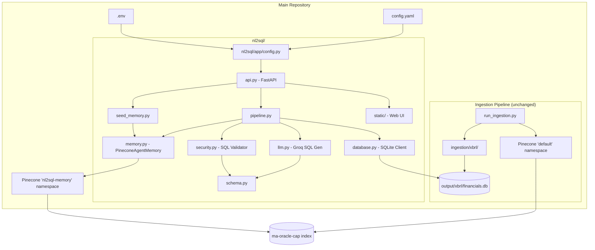
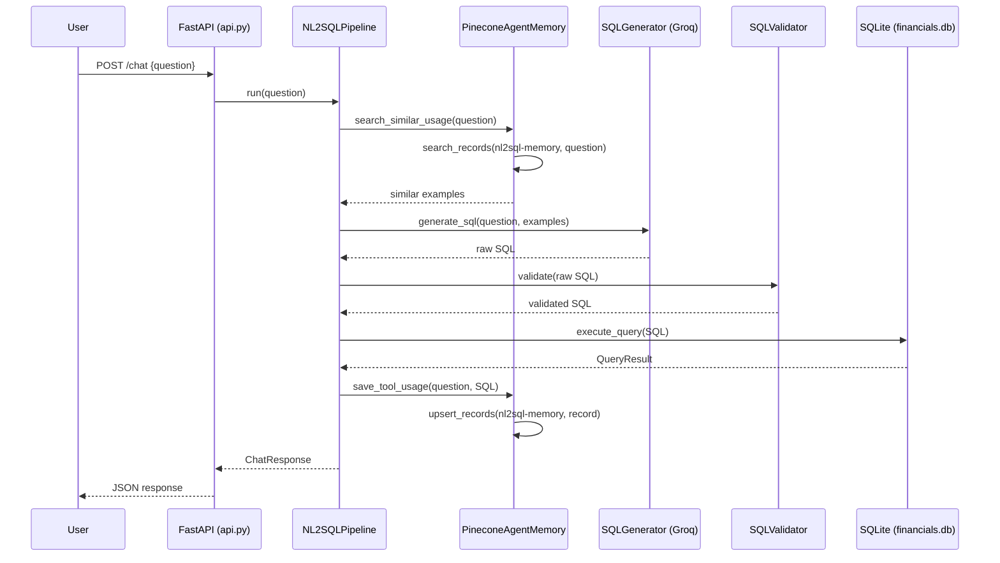

# Design Document: NL2SQL Pinecone Merge

## Overview

This design describes how to merge the standalone NL2SQL FastAPI application (`ma-oracle-nl2sql/`) into the main M&A Oracle repository. The merge involves four key changes:

1. Relocate NL2SQL modules under `nl2sql/` at the repo root
2. Point the database path to the ingestion pipeline's `output/xbrl/financials.db`
3. Replace ChromaDB/DemoAgentMemory with a Pinecone-backed memory implementation using the existing `ma-oracle-cap` index and a dedicated `nl2sql-memory` namespace
4. Unify configuration (`config.yaml` + `.env`) and dependencies (single `requirements.txt`)

The NL2SQL service's public API (`GET /health`, `POST /chat`, `GET /`, `/static`) and glassmorphism Web UI remain unchanged. The ingestion pipeline is not modified.

### Key Design Decisions

- **Pinecone integrated embedding**: The `ma-oracle-cap` index uses Pinecone's integrated embedding with `multilingual-e5-large`. The NL2SQL memory adapter will use `upsert_records` (text-in, embedding handled server-side) and `search_records` for queries, matching the pattern already used in `run_ingestion.py`. This eliminates the need for a local embedding model for memory operations.
- **Vanna AgentMemory interface preserved**: The new `PineconeAgentMemory` class implements Vanna's `AgentMemory` abstract class so that `pipeline.py`, `seed_memory.py`, and `api.py` require no changes to their memory interaction logic.
- **Namespace isolation**: NL2SQL memory lives in the `nl2sql-memory` namespace, completely separate from the `default` namespace used by the ingestion pipeline's document chunks.
- **Config layering**: `config.yaml` provides defaults; environment variables override specific values. The NL2SQL `Settings` dataclass reads from both sources via a unified loader.

## Architecture



### Request Flow



## Components and Interfaces

### 1. `nl2sql/app/config.py` — Unified Settings

Replaces the current `ma-oracle-nl2sql/app/config.py`. Reads from both `config.yaml` and `.env`.

```python
@dataclass(frozen=True)
class Settings:
    # Database
    db_path: str              # default: "output/xbrl/financials.db", env override: DB_PATH
    
    # LLM
    llm_base_url: str         # from config.yaml llm section or LLM_BASE_URL env
    llm_model: str            # from config.yaml llm section or LLM_MODEL env
    groq_api_key: str | None  # from .env GROQ_API_KEY
    
    # Server
    host: str                 # from config.yaml nl2sql.host, default "0.0.0.0"
    port: int                 # from config.yaml nl2sql.port, default 8000
    max_rows: int             # from config.yaml nl2sql.max_rows, default 200
    
    # Memory
    memory_search_limit: int  # from config.yaml nl2sql.memory_search_limit, default 4
    memory_namespace: str     # from config.yaml nl2sql.memory_namespace, default "nl2sql-memory"
    
    # Pinecone
    pinecone_api_key: str | None   # from .env PINECONE_API_KEY
    pinecone_index_name: str       # from config.yaml vector_store.pinecone.index_name
    pinecone_embed_model: str      # from config.yaml embedding.pinecone.model_name
```

Loading strategy:
1. Load `.env` via `python-dotenv`
2. Parse `config.yaml` with `pyyaml`
3. Environment variables override config.yaml values where specified

### 2. `nl2sql/app/memory.py` — PineconeAgentMemory

Replaces ChromaDB/DemoAgentMemory with a Pinecone-backed implementation of Vanna's `AgentMemory`.

Key interface methods to implement:
- `save_tool_usage(question, tool_name, args, context, success)` → upserts a record to Pinecone with `_id` derived from a hash of the question, `chunk_text` set to the question (for integrated embedding), and metadata containing `tool_name`, `sql`, and `success`.
- `search_similar_usage(question, context, limit, similarity_threshold, tool_name_filter)` → calls `search_records` on the `nl2sql-memory` namespace with the question text, returns up to `limit` results as `ToolMemorySearchResult` objects.
- `get_recent_memories(context, limit)` → lists records from the namespace (used by seed_memory to check for existing examples).

Record schema in Pinecone:
```
{
    "_id": "nl2sql-<sha256_hex[:16]_of_question>",
    "chunk_text": "<question text>",       # field used by integrated embedding
    "tool_name": "run_sql",
    "sql": "<the SQL query>",
    "success": true
}
```

The `count_memories` helper will use `index.describe_index_stats()` filtered by namespace to get the vector count.

### 3. `nl2sql/app/seed_memory.py` — Training Example Seeder

Unchanged logic. On startup, checks which training examples already exist in Pinecone (via `get_recent_memories`) and upserts any missing ones. The 19 existing `TRAINING_EXAMPLES` are preserved as-is.

The idempotency check uses deterministic `_id` values (hash of question text), so `upsert_records` naturally deduplicates.

### 4. `nl2sql/app/pipeline.py` — NL2SQL Pipeline

No changes to the pipeline logic. It calls `agent_memory.search_similar_usage()` and `agent_memory.save_tool_usage()` through the Vanna `AgentMemory` interface, which is now backed by Pinecone.

### 5. `nl2sql/app/llm.py` — SQL Generator

No changes. Continues to use Groq (OpenAI-compatible) for SQL generation.

### 6. `nl2sql/app/security.py` — SQL Validator

No changes. Continues to sanitize, validate forbidden keywords, check table/column references against schema, and verify query plans.

### 7. `nl2sql/app/database.py` — Database Client

No changes to the class. The `db_path` now defaults to `output/xbrl/financials.db` via the unified config.

### 8. `nl2sql/app/api.py` — FastAPI Application

Minor changes:
- Import paths updated from `app.*` to `nl2sql.app.*`
- Static file mount path updated to `nl2sql/static`
- `FileResponse` path updated to `nl2sql/static/index.html`

### 9. `nl2sql/main.py` — Entry Point

Updated import path. Runs `uvicorn` pointing to `nl2sql.main:app`.

### 10. `config.yaml` — New `nl2sql` Section

```yaml
# ─── NL2SQL Service ─────────────────────────────────────────
nl2sql:
  host: "0.0.0.0"
  port: 8000
  max_rows: 200
  memory_search_limit: 4
  memory_namespace: "nl2sql-memory"
  llm_base_url: "https://api.groq.com/openai/v1"
  llm_model: "openai/gpt-oss-120b"
```

### 11. `.env.example` — Updated Variables

Add to existing `.env.example`:
```
# NL2SQL / Groq LLM
GROQ_API_KEY=your_groq_api_key
# Pinecone (shared with ingestion pipeline)
PINECONE_API_KEY=your_pinecone_api_key
```

### 12. `requirements.txt` — Unified Dependencies

Add to existing `requirements.txt`:
```
# NL2SQL service
fastapi>=0.100.0
uvicorn>=0.23.0
vanna[openai]>=0.7.0
```

Remove: `chromadb` (not present in main requirements.txt, but ensure it's not added).


## Data Models

### Pinecone Memory Record

Each few-shot SQL example stored in the `nl2sql-memory` namespace:

| Field | Type | Description |
|-------|------|-------------|
| `_id` | string | `"nl2sql-"` + first 16 chars of SHA-256 hex digest of question text |
| `chunk_text` | string | The natural language question (used by Pinecone integrated embedding) |
| `tool_name` | string | Always `"run_sql"` |
| `sql` | string | The validated SQL query |
| `success` | boolean | Whether the query returned results |

### Settings (from config.yaml + .env)

```yaml
# config.yaml additions
nl2sql:
  host: "0.0.0.0"          # Server bind address
  port: 8000                # Server port
  max_rows: 200             # Max rows returned per query
  memory_search_limit: 4    # Number of similar examples to retrieve
  memory_namespace: "nl2sql-memory"  # Pinecone namespace for few-shot examples
  llm_base_url: "https://api.groq.com/openai/v1"
  llm_model: "openai/gpt-oss-120b"
```

```dotenv
# .env additions
GROQ_API_KEY=...
PINECONE_API_KEY=...       # Already present, shared with ingestion
```

### Existing Data Models (unchanged)

- `ChatRequest` / `ChatResponse` / `HealthResponse` — Pydantic models in `models.py`
- `DatabaseSchema` / `TableSchema` / `ColumnSchema` — schema introspection in `schema.py`
- `QueryResult` — query execution result in `database.py`
- `ToolMemory` / `ToolMemorySearchResult` — Vanna memory types used by `seed_memory.py` and `pipeline.py`

### File System Layout After Merge

```
repo-root/
├── config.yaml              # Unified config (+ new nl2sql section)
├── .env                     # Secrets (PINECONE_API_KEY, GROQ_API_KEY, etc.)
├── .env.example             # Updated with NL2SQL variables
├── requirements.txt         # Unified dependencies
├── run_ingestion.py         # Unchanged
├── providers.py             # Unchanged
├── ingestion/               # Unchanged
│   └── xbrl/storage.py      # Produces output/xbrl/financials.db
├── output/
│   └── xbrl/financials.db   # Shared database
├── nl2sql/
│   ├── main.py              # Entry point: python -m nl2sql.main
│   ├── static/
│   │   ├── index.html
│   │   ├── script.js
│   │   └── style.css
│   └── app/
│       ├── __init__.py
│       ├── api.py
│       ├── config.py         # Reads config.yaml + .env
│       ├── database.py
│       ├── llm.py
│       ├── memory.py         # PineconeAgentMemory (replaces ChromaDB)
│       ├── models.py
│       ├── pipeline.py
│       ├── schema.py
│       ├── security.py
│       └── seed_memory.py
└── ma-oracle-nl2sql/         # Removed after merge
```


## Correctness Properties

*A property is a characteristic or behavior that should hold true across all valid executions of a system — essentially, a formal statement about what the system should do. Properties serve as the bridge between human-readable specifications and machine-verifiable correctness guarantees.*

### Property 1: Config environment variable override

*For any* config field that supports environment variable override (DB_PATH, LLM_MODEL, LLM_BASE_URL), setting the corresponding environment variable to any non-empty string value should cause `get_settings()` to return that value instead of the `config.yaml` default.

**Validates: Requirements 2.2, 4.4**

### Property 2: Memory store-and-retrieve round trip

*For any* valid question string and valid SQL string, upserting the question-SQL pair into PineconeAgentMemory and then searching with the same question text should return a result set that contains the original SQL string.

**Validates: Requirements 3.1, 3.3, 6.7**

### Property 3: Search result count respects limit

*For any* PineconeAgentMemory instance with N stored examples and any search query, the number of results returned by `search_similar_usage` should be less than or equal to the configured `memory_search_limit`.

**Validates: Requirements 3.4**

### Property 4: Seed memory is idempotent

*For any* initial state of the Pinecone `nl2sql-memory` namespace (empty or partially seeded), running `seed_agent_memory` twice in succession should result in the same set of records as running it once — no duplicates are created.

**Validates: Requirements 3.6**

### Property 5: SQL validator rejects write operations

*For any* SQL string containing one or more forbidden keywords (INSERT, UPDATE, DELETE, DROP, ALTER, CREATE, REPLACE, TRUNCATE, ATTACH, DETACH, PRAGMA, VACUUM, REINDEX, ANALYZE), the `SQLValidator.validate()` method should raise `SqlValidationError`.

**Validates: Requirements 6.5**

### Property 6: SQL validator rejects unknown schema references

*For any* SQL SELECT query that references a table name not present in the database schema, or a qualified column reference (`table.column`) where the column does not exist in the referenced table, the `SQLValidator.validate()` method should raise `SqlValidationError`.

**Validates: Requirements 6.6**

## Error Handling

| Scenario | Component | Behavior |
|----------|-----------|----------|
| `financials.db` missing | `DatabaseClient.check_connection()` | Returns `False`; `/health` reports `database: "disconnected"` |
| `financials.db` missing | `NL2SQLPipeline.run()` | `execute_query` raises `QueryExecutionError`; pipeline returns error `ChatResponse` |
| `PINECONE_API_KEY` missing | `PineconeAgentMemory.__init__` | Raises `ValueError` at startup with clear message |
| `GROQ_API_KEY` missing | `SQLGenerator.generate_sql()` | Raises `SqlGenerationError("Missing GROQ_API_KEY")` |
| Pinecone rate limit (429) | `PineconeAgentMemory.save_tool_usage` | Retry with exponential backoff (up to 3 attempts), then log warning and continue (non-fatal — the query still returns results to the user) |
| Pinecone search failure | `PineconeAgentMemory.search_similar_usage` | Log warning, return empty list (pipeline proceeds without few-shot examples) |
| LLM returns empty/invalid SQL | `SQLGenerator.generate_sql()` | Raises `SqlGenerationError`; pipeline returns error `ChatResponse` |
| SQL contains forbidden keywords | `SQLValidator.validate()` | Raises `SqlValidationError`; pipeline returns error `ChatResponse` |
| SQL references unknown table/column | `SQLValidator.validate()` | Raises `SqlValidationError`; pipeline returns error `ChatResponse` |
| Query returns 0 rows | `NL2SQLPipeline.run()` | Returns `ChatResponse` with `row_count=0` and informative message; does NOT save to memory |
| Empty question | `NL2SQLPipeline.run()` | Returns `ChatResponse` with "Please send a non-empty question" |
| Seed memory fails | `seed_agent_memory()` | Logs error, continues startup (service is usable without seed examples) |

## Testing Strategy

### Property-Based Tests

Use `hypothesis` (Python property-based testing library) with minimum 100 iterations per property.

Each property test must be tagged with a comment referencing the design property:

```python
# Feature: nl2sql-pinecone-merge, Property 1: Config environment variable override
# Feature: nl2sql-pinecone-merge, Property 2: Memory store-and-retrieve round trip
# Feature: nl2sql-pinecone-merge, Property 3: Search result count respects limit
# Feature: nl2sql-pinecone-merge, Property 4: Seed memory is idempotent
# Feature: nl2sql-pinecone-merge, Property 5: SQL validator rejects write operations
# Feature: nl2sql-pinecone-merge, Property 6: SQL validator rejects unknown schema references
```

Each correctness property MUST be implemented by a SINGLE property-based test.

**Property 1** (Config env override): Generate random string values for DB_PATH, LLM_MODEL, LLM_BASE_URL env vars. Set them, call `get_settings()`, verify the returned value matches the env var.

**Property 2** (Memory round trip): Generate random question strings and SQL strings. Upsert via `save_tool_usage`, then `search_similar_usage` with the same question. Verify the SQL appears in results. This requires a Pinecone test namespace or a mock that preserves the upsert/search contract.

**Property 3** (Search result count): Generate a memory with N random examples (N drawn from 0..50). Search with a random query and a random limit (1..10). Verify `len(results) <= limit`.

**Property 4** (Seed idempotency): Start with a random subset of training examples already in memory. Run `seed_agent_memory` twice. Verify the total count equals `len(TRAINING_EXAMPLES)` after both runs.

**Property 5** (Reject write ops): Generate random SQL strings that contain at least one forbidden keyword (drawn from the 14 forbidden keywords) embedded in otherwise valid-looking SQL. Verify `SqlValidationError` is raised.

**Property 6** (Reject unknown schema): Generate random table names not in the schema and construct `SELECT * FROM <random_table>` queries. Also generate qualified column references with non-existent columns. Verify `SqlValidationError` is raised.

### Unit Tests

Unit tests cover specific examples, edge cases, and integration points:

- **Config defaults**: Verify `get_settings()` returns expected defaults when no env overrides are set
- **Config YAML parsing**: Verify the `nl2sql` section is correctly parsed from `config.yaml`
- **Health endpoint**: Test `GET /health` returns correct JSON structure with `status`, `database`, `agent_memory_items`
- **Chat endpoint**: Test `POST /chat` with a known question against a test `financials.db` returns expected response structure
- **Static file serving**: Test `GET /` returns HTML, `GET /static/style.css` returns CSS
- **Memory namespace isolation**: Verify PineconeAgentMemory targets `nl2sql-memory` namespace
- **SQL validator edge cases**: Empty string, SQL with comments, multiple statements, SQL wrapped in markdown code blocks
- **Database disconnected**: Test health endpoint when `financials.db` doesn't exist
- **Empty question**: Test `POST /chat` with empty/whitespace question returns appropriate error message

### Test Configuration

- Property-based tests: `hypothesis` with `@settings(max_examples=100)`
- Unit tests: `pytest`
- SQL validator tests can run without external services (pure logic)
- Memory tests that hit Pinecone should use a dedicated test namespace or mock the Pinecone client
- Config tests should use `monkeypatch` for environment variables and temporary YAML files

